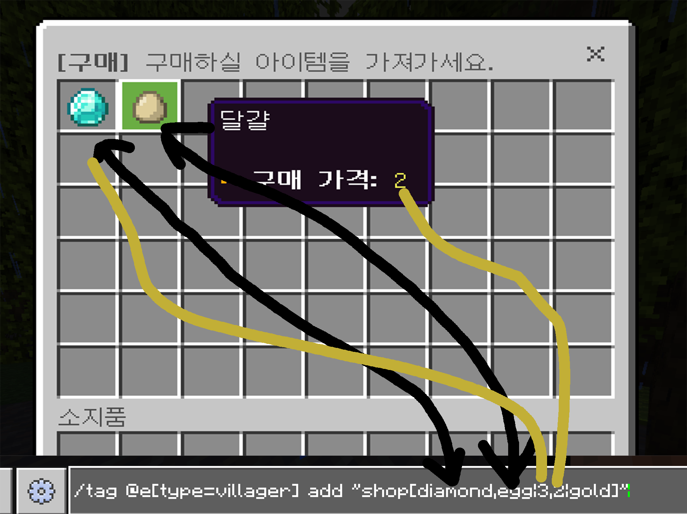

# Custom-shop
## Custom shop plugins available in BDSX.     
BDSX 커스텀 상점 플러그인     
     
### 사용법          
엔티티한테 태그를 추가하여 상점을 제작할 수 있습니다.     
     
태그: shop[아이템1_ID,아이템2_ID,아이템3_ID|아이템1_개수,아이템2_개수,아이템3_개수|스코어 이름]     
     
EX) tag @e[type=villager] add "shop[minecraft:apple,minecraft:lime_dye,minecraft:egg|1,3,2|s]"     
주민한테 첫번째 슬롯에 가격이 1인 사과, 두번째 슬롯에 가격이 3인 연두색 염료, 세번쨰 슬롯에 가격이 2인 달걀 상점을 추가 (돈 스코어는 s)     
     

     
복잡해 보이지만 이해하면 쉽습니다     
     
### 플러그인     
해당 플러그인은 mdisprgm님의 hsmenu를 사용하고 있습니다. https://github.com/mdisprgm/bdsx-hsmenu
